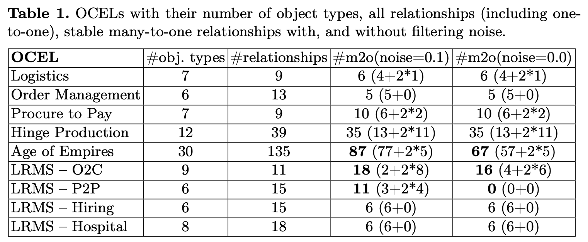

# To bind or not to bind? Replaying object-centric processes under stable relationships

This repository contains:
- the [extended version](extended_paper.pdf) of the paper including the detailed proof of our theorems in the appendix,
- an implementation of our transformations:
  * a [python script](src/ocpn2opid.py) implementing the transformations presented in the paper
  * a [directory](examples) with the results obtained by the transformations for a number of [sample OCPNs](https://github.com/rwth-pads/ocpn-visualizer/tree/master/public/sample_ocpns/json); these results are also summarized in the table below
- to inspect object type relationships in OCELs:
  * a [python script](src/ocel_inspector.py) based on [pm4py](https://pypi.org/project/pm4py/) that counts such relationships of [benchmark OCELs](https://www.ocel-standard.org/event-logs/overview/),
  *  and the [results](result.txt) obtained by this script for the OCELs for Logistics, Order Management, Procure-to-Pay, LRMS, Hinge Production, and Age of Empires.

## Transformation script

The Python command line script can be called as
```sh
 $ python3 ocpn2opid.py examples/Recruiting/ocpn.json 
 $ python3 ocpn2opid.py -R "[(offers:applications)]" examples/Recruiting/ocpn.json 
```

It takes an OCPN in [json format](https://github.com/rwth-pads/ocpn-visualizer/) as input, and produces a pnml file out.pnml and a .dot visualization of the resulting OPID in out.dot.
The `-R` parameter is optional: if it is omitted, only transformation T1 is applied. Otherwise, -R should be followed by a list of pairs of object types that should be considered many-to-one relationships, in a format such as `[(many1:one1),(many2:one2),(many3:one3)]`.

We applied our script to the sample OCPNs in [this repository](https://github.com/rwth-pads/ocpn-visualizer/), excluding nets that have only one object type or are otherwise syntactic. The following table summarizes the results:

OCPN2OPID Tests

# OCPN2OPID Tests

## Script

The Python command-line script can be obtained [here](code.zip).

## Tests

|     |     |     |     |
| --- | --- | --- | --- |
| **OCPN** | **OPID N1** | **many-to-one relations** | **OPID N2** |
| [Applications and offers](./examples/Applications_and_offers/ocpn.json) | [pnml](./examples/Applications_and_offers/N1.pnml), [png](./examples/Applications_and_offers/N1.png), [pdf](./examples/Applications_and_offers/N1.pdf) | \[(offer:application)\] | [pnml](./examples/Applications_and_offers/N2.pnml), [png](./examples/Applications_and_offers/N2.png), [pdf](./examples/Applications_and_offers/N2.pdf) |
| [Cyclic OCPN](./examples/Cyclic_OCPN/ocpn.json) | [pnml](./examples/Cyclic_OCPN/N1.pnml), [png](./examples/Cyclic_OCPN/N1.png), [pdf](./examples/Cyclic_OCPN/N1.pdf) | \[(item:order)\] | [pnml](./examples/Cyclic_OCPN/N2.pnml), [png](./examples/Cyclic_OCPN/N2.png), [pdf](./examples/Cyclic_OCPN/N2.pdf) |
| [Exported P2P](./examples/Exported_P2P/ocpn.json) | [pnml](./examples/Exported_P2P/N1.pnml), [png](./examples/Exported_P2P/N1.png), [pdf](./examples/Exported_P2P/N1.pdf) | \[(MATERIAL:PURCHREQ),(MATERIAL:PURCHORD)\] | [pnml](./examples/Exported_P2P/N2.pnml), [png](./examples/Exported_P2P/N2.png), [pdf](./examples/Exported_P2P/N2.pdf) |
| [Kolloquium example](./examples/Kolloquium_example/ocpn.json) | [pnml](./examples/Kolloquium_example/N1.pnml), [png](./examples/Kolloquium_example/N1.png), [pdf](./examples/Kolloquium_example/N1.pdf) | \[(turq:yel),(yel:turq)\] | [pnml](./examples/Kolloquium_example/N2.pnml), [png](./examples/Kolloquium_example/N2.png), [pdf](./examples/Kolloquium_example/N2.pdf) |
| [OCPA P2P](./examples/OCPA_P2P/ocpn.json) | [pnml](./examples/OCPA_P2P/N1.pnml), [png](./examples/OCPA_P2P/N1.png), [pdf](./examples/OCPA_P2P/N1.pdf) | \[(item:order)\] | [pnml](./examples/OCPA_P2P/N2.pnml), [png](./examples/OCPA_P2P/N2.png), [pdf](./examples/OCPA_P2P/N2.pdf) |
| [Order Process](./examples/Order_Process/ocpn.json) | [pnml](./examples/Order_Process/N1.pnml), [png](./examples/Order_Process/N1.png), [pdf](./examples/Order_Process/N1.pdf) | \[(item:order)\] | [pnml](./examples/Order_Process/N2.pnml), [png](./examples/Order_Process/N2.png), [pdf](./examples/Order_Process/N2.pdf) |
| [Recruiting](./examples/Recruiting/ocpn.json) | [pnml](./examples/Recruiting/N1.pnml), [png](./examples/Recruiting/N1.png), [pdf](./examples/Recruiting/N1.pdf) | \[(offers:applications)\] | [pnml](./examples/Recruiting/N2.pnml), [png](./examples/Recruiting/N2.png), [pdf](./examples/Recruiting/N2.pdf) |
| [Syntactic cyclic OCPN](./examples/Syntactic_cyclic_OCPN/ocpn.json) | [pnml](./examples/Syntactic_cyclic_OCPN/N1.pnml), [png](./examples/Syntactic_cyclic_OCPN/N1.png), [pdf](./examples/Syntactic_cyclic_OCPN/N1.pdf) |     | [pnml](./examples/Syntactic_cyclic_OCPN/N2.pnml), [png](./examples/Syntactic_cyclic_OCPN/N2.png), [pdf](./examples/Syntactic_cyclic_OCPN/N2.pdf) |

## Object relationships in OCELs: Results

The results of our analysis are displayed in the following table. For each analyzed OCEL, it holds the number of object types, and the number of bidirectional relationships between object types. The relationships can be of three different types: many-to-many, many-to-one, and one-to-one. In the paper, we define stable m2o relationships. As elaborated, a many-to-one relationship manifests as one stable m2o relationship in our approach, while a bi-directional one-to-one relationship manifests two stable m2o relationships.

For every OCEL, we calculate the number of stable many-to-one relationships (m2o) with a filtered noise threshold of 0.1, and 0.0 (no filter). The number of stable m2o relationships combines all many-to-one relationships, and double the number of the bi-directional one-to-one relationships.

For instance, the LRMS-O2C log with noise 0.1 holds, in total, 11 relationships, with 1 many-to-many, 2 many-to-one, and 8 one-to-one relationships. Hence, we add up to 2 + 2*8 = 18 stable m2o relationships.


